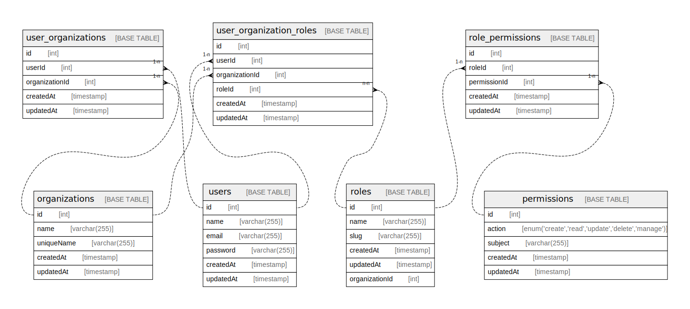

# ramen_db

## Tables

| Name | Columns | Comment | Type |
| ---- | ------- | ------- | ---- |
| [budgets](budgets.md) | 7 |  | BASE TABLE |
| [categories](categories.md) | 9 |  | BASE TABLE |
| [invoice_items](invoice_items.md) | 8 |  | BASE TABLE |
| [invoices](invoices.md) | 16 |  | BASE TABLE |
| [organizations](organizations.md) | 11 |  | BASE TABLE |
| [permissions](permissions.md) | 5 |  | BASE TABLE |
| [projects](projects.md) | 10 |  | BASE TABLE |
| [role_permissions](role_permissions.md) | 5 |  | BASE TABLE |
| [roles](roles.md) | 6 |  | BASE TABLE |
| [user_organization_invoices](user_organization_invoices.md) | 6 |  | BASE TABLE |
| [user_organization_roles](user_organization_roles.md) | 6 |  | BASE TABLE |
| [user_organizations](user_organizations.md) | 5 |  | BASE TABLE |
| [users](users.md) | 9 |  | BASE TABLE |

## Relations

---

> Generated by [tbls](https://github.com/k1LoW/tbls)
