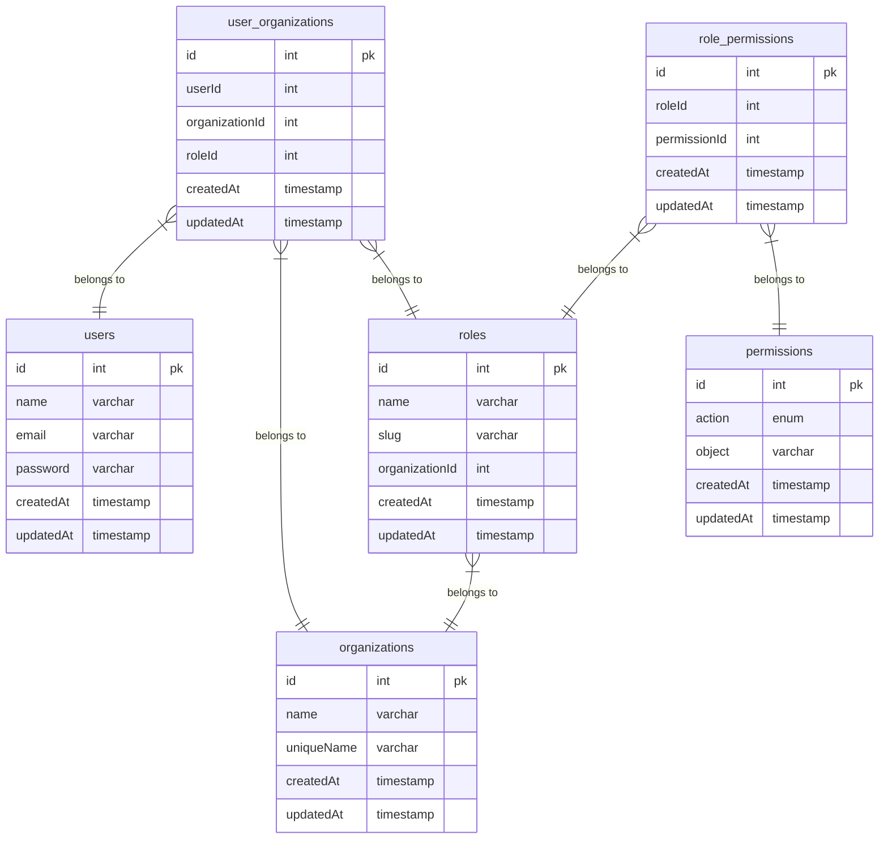

# Database

## Tables

| Name             | Columns | Comment | Type       |
| ---------------- | ------- | ------- | ---------- |
| organizations    | 5       |         | BASE TABLE |
| roles            | 6       |         | BASE TABLE |
| users            | 8       |         | BASE TABLE |
| permissions      | 5       |         | BASE TABLE |
| role_permissions | 5       |         | BASE TABLE |

## Relations

