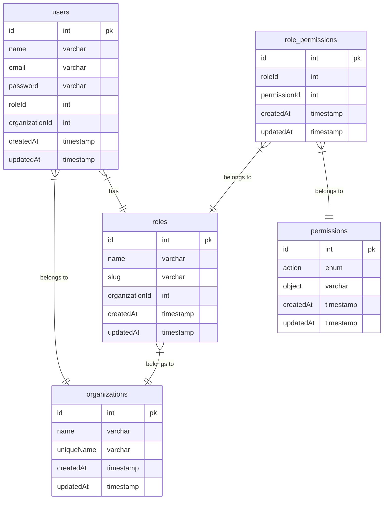

# database

## Tables

| Name                                    | Columns | Comment | Type       |
| --------------------------------------- | ------- | ------- | ---------- |
| [organizations](organizations.md)       | 5       |         | BASE TABLE |
| [roles](roles.md)                       | 6       |         | BASE TABLE |
| [users](users.md)                       | 8       |         | BASE TABLE |
| [permissions](permissions.md)           | 5       |         | BASE TABLE |
| [role_permissions](role_permissions.md) | 5       |         | BASE TABLE |

## Relations

