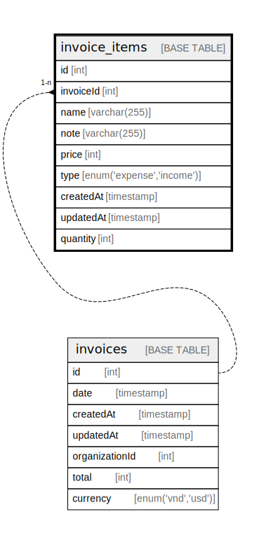

# invoice_items

## Description

<details>
<summary><strong>Table Definition</strong></summary>

```sql
CREATE TABLE `invoice_items` (
  `id` int NOT NULL AUTO_INCREMENT,
  `invoiceId` int NOT NULL,
  `name` varchar(255) NOT NULL,
  `note` varchar(255) DEFAULT NULL,
  `price` int NOT NULL,
  `type` enum('expense','income') NOT NULL,
  `createdAt` timestamp NOT NULL DEFAULT CURRENT_TIMESTAMP,
  `updatedAt` timestamp NOT NULL DEFAULT CURRENT_TIMESTAMP,
  `quantity` int NOT NULL DEFAULT '1',
  PRIMARY KEY (`id`)
) ENGINE=InnoDB AUTO_INCREMENT=[Redacted by tbls] DEFAULT CHARSET=utf8mb3
```

</details>

## Columns

| Name | Type | Default | Nullable | Extra Definition | Children | Parents | Comment |
| ---- | ---- | ------- | -------- | ---------------- | -------- | ------- | ------- |
| id | int |  | false | auto_increment |  |  |  |
| invoiceId | int |  | false |  |  | [invoices](invoices.md) |  |
| name | varchar(255) |  | false |  |  |  |  |
| note | varchar(255) |  | true |  |  |  |  |
| price | int |  | false |  |  |  |  |
| type | enum('expense','income') |  | false |  |  |  |  |
| createdAt | timestamp | CURRENT_TIMESTAMP | false | DEFAULT_GENERATED |  |  |  |
| updatedAt | timestamp | CURRENT_TIMESTAMP | false | DEFAULT_GENERATED |  |  |  |
| quantity | int | 1 | false |  |  |  |  |

## Constraints

| Name | Type | Definition |
| ---- | ---- | ---------- |
| PRIMARY | PRIMARY KEY | PRIMARY KEY (id) |

## Indexes

| Name | Definition |
| ---- | ---------- |
| PRIMARY | PRIMARY KEY (id) USING BTREE |

## Relations



---

> Generated by [tbls](https://github.com/k1LoW/tbls)
