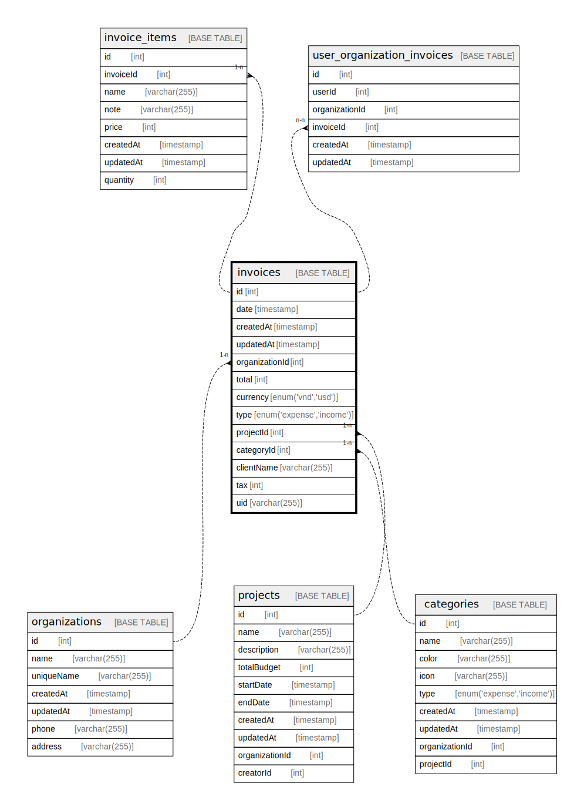

# invoices

## Description

<details>
<summary><strong>Table Definition</strong></summary>

```sql
CREATE TABLE `invoices` (
  `id` int NOT NULL AUTO_INCREMENT,
  `date` timestamp NULL DEFAULT NULL,
  `createdAt` timestamp NOT NULL DEFAULT CURRENT_TIMESTAMP,
  `updatedAt` timestamp NOT NULL DEFAULT CURRENT_TIMESTAMP,
  `organizationId` int NOT NULL,
  `total` int DEFAULT NULL,
  `currency` enum('vnd','usd') NOT NULL,
  `type` enum('expense','income') NOT NULL,
  `projectId` int NOT NULL,
  `categoryId` int DEFAULT NULL,
  `clientName` varchar(255) DEFAULT NULL,
  `tax` int DEFAULT NULL,
  `uid` varchar(255) DEFAULT NULL,
  `exchangeRate` decimal(10,0) DEFAULT NULL,
  PRIMARY KEY (`id`)
) ENGINE=InnoDB AUTO_INCREMENT=[Redacted by tbls] DEFAULT CHARSET=utf8mb3
```

</details>

## Columns

| Name | Type | Default | Nullable | Extra Definition | Children | Parents | Comment |
| ---- | ---- | ------- | -------- | ---------------- | -------- | ------- | ------- |
| id | int |  | false | auto_increment | [invoice_items](invoice_items.md) [user_organization_invoices](user_organization_invoices.md) |  |  |
| date | timestamp |  | true |  |  |  |  |
| createdAt | timestamp | CURRENT_TIMESTAMP | false | DEFAULT_GENERATED |  |  |  |
| updatedAt | timestamp | CURRENT_TIMESTAMP | false | DEFAULT_GENERATED |  |  |  |
| organizationId | int |  | false |  |  | [organizations](organizations.md) |  |
| total | int |  | true |  |  |  |  |
| currency | enum('vnd','usd') |  | false |  |  |  |  |
| type | enum('expense','income') |  | false |  |  |  |  |
| projectId | int |  | false |  |  | [projects](projects.md) |  |
| categoryId | int |  | true |  |  | [categories](categories.md) |  |
| clientName | varchar(255) |  | true |  |  |  |  |
| tax | int |  | true |  |  |  |  |
| uid | varchar(255) |  | true |  |  |  |  |
| exchangeRate | decimal(10,0) |  | true |  |  |  |  |

## Constraints

| Name | Type | Definition |
| ---- | ---- | ---------- |
| PRIMARY | PRIMARY KEY | PRIMARY KEY (id) |

## Indexes

| Name | Definition |
| ---- | ---------- |
| PRIMARY | PRIMARY KEY (id) USING BTREE |

## Relations



---

> Generated by [tbls](https://github.com/k1LoW/tbls)
