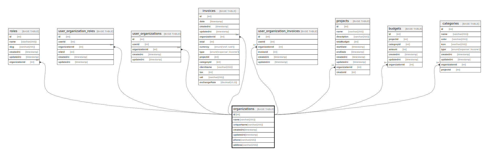

# organizations

## Description

<details>
<summary><strong>Table Definition</strong></summary>

```sql
CREATE TABLE `organizations` (
  `id` int NOT NULL AUTO_INCREMENT,
  `name` varchar(255) NOT NULL,
  `uniqueName` varchar(255) NOT NULL,
  `createdAt` timestamp NOT NULL DEFAULT CURRENT_TIMESTAMP,
  `updatedAt` timestamp NOT NULL DEFAULT CURRENT_TIMESTAMP,
  `phone` varchar(255) DEFAULT NULL,
  `address` varchar(255) DEFAULT NULL,
  `dateFormat` varchar(255) NOT NULL DEFAULT 'dd/MM/yyyy',
  `currency` enum('vnd','usd') NOT NULL DEFAULT 'usd',
  `bank` enum('bidv','vcb') NOT NULL DEFAULT 'bidv',
  `exchangeRate` int NOT NULL DEFAULT '25464',
  PRIMARY KEY (`id`),
  UNIQUE KEY `UQ_30955c69c151c28bc7c92e663f7` (`uniqueName`)
) ENGINE=InnoDB AUTO_INCREMENT=[Redacted by tbls] DEFAULT CHARSET=utf8mb3
```

</details>

## Columns

| Name | Type | Default | Nullable | Extra Definition | Children | Parents | Comment |
| ---- | ---- | ------- | -------- | ---------------- | -------- | ------- | ------- |
| id | int |  | false | auto_increment | [roles](roles.md) [user_organization_roles](user_organization_roles.md) [user_organizations](user_organizations.md) [invoices](invoices.md) [user_organization_invoices](user_organization_invoices.md) [projects](projects.md) [budgets](budgets.md) [categories](categories.md) |  |  |
| name | varchar(255) |  | false |  |  |  |  |
| uniqueName | varchar(255) |  | false |  |  |  |  |
| createdAt | timestamp | CURRENT_TIMESTAMP | false | DEFAULT_GENERATED |  |  |  |
| updatedAt | timestamp | CURRENT_TIMESTAMP | false | DEFAULT_GENERATED |  |  |  |
| phone | varchar(255) |  | true |  |  |  |  |
| address | varchar(255) |  | true |  |  |  |  |
| dateFormat | varchar(255) | dd/MM/yyyy | false |  |  |  |  |
| currency | enum('vnd','usd') | usd | false |  |  |  |  |
| bank | enum('bidv','vcb') | bidv | false |  |  |  |  |
| exchangeRate | int | 25464 | false |  |  |  |  |

## Constraints

| Name | Type | Definition |
| ---- | ---- | ---------- |
| PRIMARY | PRIMARY KEY | PRIMARY KEY (id) |
| UQ_30955c69c151c28bc7c92e663f7 | UNIQUE | UNIQUE KEY UQ_30955c69c151c28bc7c92e663f7 (uniqueName) |

## Indexes

| Name | Definition |
| ---- | ---------- |
| PRIMARY | PRIMARY KEY (id) USING BTREE |
| UQ_30955c69c151c28bc7c92e663f7 | UNIQUE KEY UQ_30955c69c151c28bc7c92e663f7 (uniqueName) USING BTREE |

## Relations



---

> Generated by [tbls](https://github.com/k1LoW/tbls)
