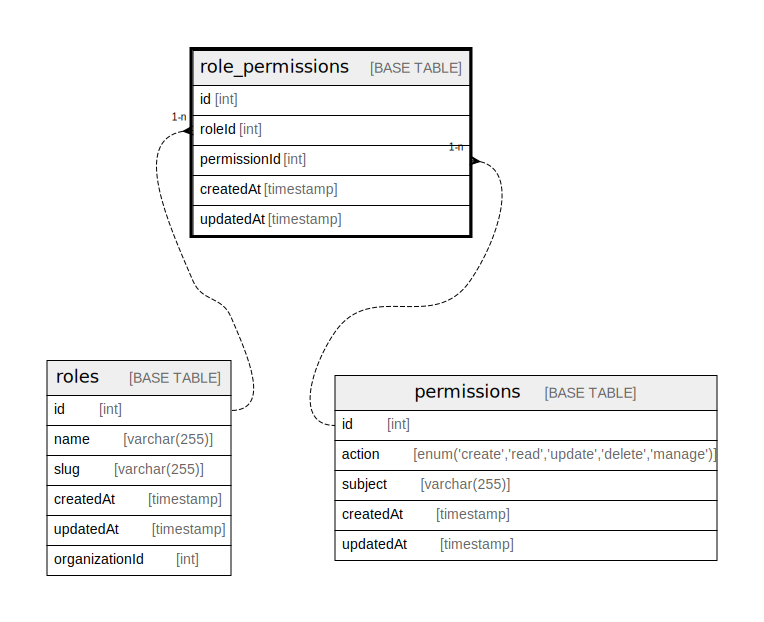

# role_permissions

## Description

<details>
<summary><strong>Table Definition</strong></summary>

```sql
CREATE TABLE `role_permissions` (
  `id` int NOT NULL AUTO_INCREMENT,
  `roleId` int NOT NULL,
  `permissionId` int NOT NULL,
  `createdAt` timestamp NOT NULL DEFAULT CURRENT_TIMESTAMP,
  `updatedAt` timestamp NOT NULL DEFAULT CURRENT_TIMESTAMP ON UPDATE CURRENT_TIMESTAMP,
  PRIMARY KEY (`id`),
  UNIQUE KEY `IDX_RoleIdPermissionIdOnRolePermissions` (`roleId`,`permissionId`),
  KEY `IDX_PermissionIdOnRolePermissions` (`permissionId`)
) ENGINE=InnoDB AUTO_INCREMENT=[Redacted by tbls] DEFAULT CHARSET=utf8mb3
```

</details>

## Columns

| Name | Type | Default | Nullable | Extra Definition | Children | Parents | Comment |
| ---- | ---- | ------- | -------- | ---------------- | -------- | ------- | ------- |
| id | int |  | false | auto_increment |  |  |  |
| roleId | int |  | false |  |  | [roles](roles.md) |  |
| permissionId | int |  | false |  |  | [permissions](permissions.md) |  |
| createdAt | timestamp | CURRENT_TIMESTAMP | false | DEFAULT_GENERATED |  |  |  |
| updatedAt | timestamp | CURRENT_TIMESTAMP | false | DEFAULT_GENERATED on update CURRENT_TIMESTAMP |  |  |  |

## Constraints

| Name | Type | Definition |
| ---- | ---- | ---------- |
| IDX_RoleIdPermissionIdOnRolePermissions | UNIQUE | UNIQUE KEY IDX_RoleIdPermissionIdOnRolePermissions (roleId, permissionId) |
| PRIMARY | PRIMARY KEY | PRIMARY KEY (id) |

## Indexes

| Name | Definition |
| ---- | ---------- |
| IDX_PermissionIdOnRolePermissions | KEY IDX_PermissionIdOnRolePermissions (permissionId) USING BTREE |
| PRIMARY | PRIMARY KEY (id) USING BTREE |
| IDX_RoleIdPermissionIdOnRolePermissions | UNIQUE KEY IDX_RoleIdPermissionIdOnRolePermissions (roleId, permissionId) USING BTREE |

## Relations



---

> Generated by [tbls](https://github.com/k1LoW/tbls)
