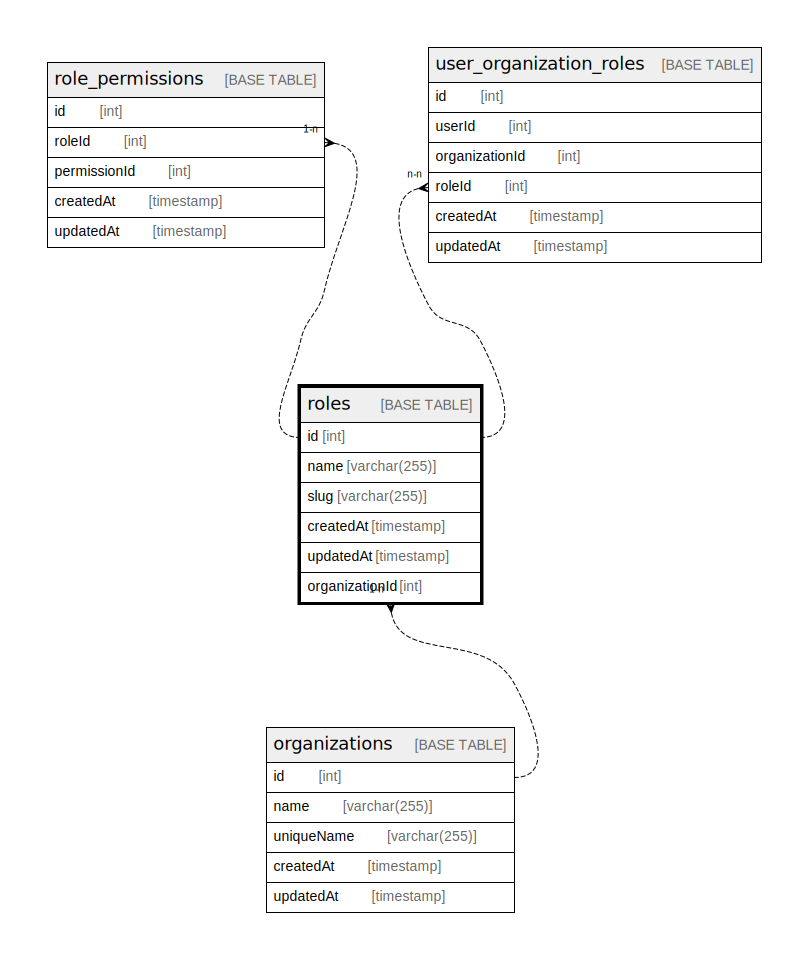

# roles

## Description

<details>
<summary><strong>Table Definition</strong></summary>

```sql
CREATE TABLE `roles` (
  `id` int NOT NULL AUTO_INCREMENT,
  `name` varchar(255) NOT NULL,
  `slug` varchar(255) NOT NULL,
  `createdAt` timestamp NOT NULL DEFAULT CURRENT_TIMESTAMP,
  `updatedAt` timestamp NOT NULL DEFAULT CURRENT_TIMESTAMP,
  `organizationId` int NOT NULL,
  PRIMARY KEY (`id`),
  UNIQUE KEY `UQ_648e3f5447f725579d7d4ffdfb7` (`name`),
  UNIQUE KEY `UQ_881f72bac969d9a00a1a29e1079` (`slug`)
) ENGINE=InnoDB AUTO_INCREMENT=[Redacted by tbls] DEFAULT CHARSET=utf8mb3
```

</details>

## Columns

| Name | Type | Default | Nullable | Extra Definition | Children | Parents | Comment |
| ---- | ---- | ------- | -------- | ---------------- | -------- | ------- | ------- |
| id | int |  | false | auto_increment | [role_permissions](role_permissions.md) [user_organization_roles](user_organization_roles.md) |  |  |
| name | varchar(255) |  | false |  |  |  |  |
| slug | varchar(255) |  | false |  |  |  |  |
| createdAt | timestamp | CURRENT_TIMESTAMP | false | DEFAULT_GENERATED |  |  |  |
| updatedAt | timestamp | CURRENT_TIMESTAMP | false | DEFAULT_GENERATED |  |  |  |
| organizationId | int |  | false |  |  |  |  |

## Constraints

| Name | Type | Definition |
| ---- | ---- | ---------- |
| PRIMARY | PRIMARY KEY | PRIMARY KEY (id) |
| UQ_648e3f5447f725579d7d4ffdfb7 | UNIQUE | UNIQUE KEY UQ_648e3f5447f725579d7d4ffdfb7 (name) |
| UQ_881f72bac969d9a00a1a29e1079 | UNIQUE | UNIQUE KEY UQ_881f72bac969d9a00a1a29e1079 (slug) |

## Indexes

| Name | Definition |
| ---- | ---------- |
| PRIMARY | PRIMARY KEY (id) USING BTREE |
| UQ_648e3f5447f725579d7d4ffdfb7 | UNIQUE KEY UQ_648e3f5447f725579d7d4ffdfb7 (name) USING BTREE |
| UQ_881f72bac969d9a00a1a29e1079 | UNIQUE KEY UQ_881f72bac969d9a00a1a29e1079 (slug) USING BTREE |

## Relations



---

> Generated by [tbls](https://github.com/k1LoW/tbls)
