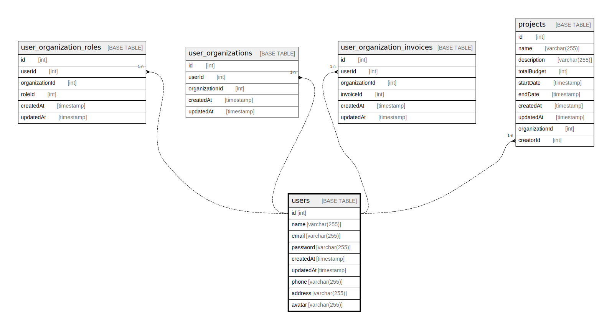

# users

## Description

<details>
<summary><strong>Table Definition</strong></summary>

```sql
CREATE TABLE `users` (
  `id` int NOT NULL AUTO_INCREMENT,
  `name` varchar(255) DEFAULT NULL,
  `email` varchar(255) NOT NULL,
  `password` varchar(255) DEFAULT NULL,
  `createdAt` timestamp NOT NULL DEFAULT CURRENT_TIMESTAMP,
  `updatedAt` timestamp NOT NULL DEFAULT CURRENT_TIMESTAMP,
  `phone` varchar(255) DEFAULT NULL,
  `address` varchar(255) DEFAULT NULL,
  `avatar` varchar(255) DEFAULT NULL,
  PRIMARY KEY (`id`),
  UNIQUE KEY `UQ_97672ac88f789774dd47f7c8be3` (`email`)
) ENGINE=InnoDB AUTO_INCREMENT=[Redacted by tbls] DEFAULT CHARSET=utf8mb3
```

</details>

## Columns

| Name | Type | Default | Nullable | Extra Definition | Children | Parents | Comment |
| ---- | ---- | ------- | -------- | ---------------- | -------- | ------- | ------- |
| id | int |  | false | auto_increment | [user_organization_roles](user_organization_roles.md) [user_organizations](user_organizations.md) [user_organization_invoices](user_organization_invoices.md) [projects](projects.md) |  |  |
| name | varchar(255) |  | true |  |  |  |  |
| email | varchar(255) |  | false |  |  |  |  |
| password | varchar(255) |  | true |  |  |  |  |
| createdAt | timestamp | CURRENT_TIMESTAMP | false | DEFAULT_GENERATED |  |  |  |
| updatedAt | timestamp | CURRENT_TIMESTAMP | false | DEFAULT_GENERATED |  |  |  |
| phone | varchar(255) |  | true |  |  |  |  |
| address | varchar(255) |  | true |  |  |  |  |
| avatar | varchar(255) |  | true |  |  |  |  |

## Constraints

| Name | Type | Definition |
| ---- | ---- | ---------- |
| PRIMARY | PRIMARY KEY | PRIMARY KEY (id) |
| UQ_97672ac88f789774dd47f7c8be3 | UNIQUE | UNIQUE KEY UQ_97672ac88f789774dd47f7c8be3 (email) |

## Indexes

| Name | Definition |
| ---- | ---------- |
| PRIMARY | PRIMARY KEY (id) USING BTREE |
| UQ_97672ac88f789774dd47f7c8be3 | UNIQUE KEY UQ_97672ac88f789774dd47f7c8be3 (email) USING BTREE |

## Relations



---

> Generated by [tbls](https://github.com/k1LoW/tbls)
