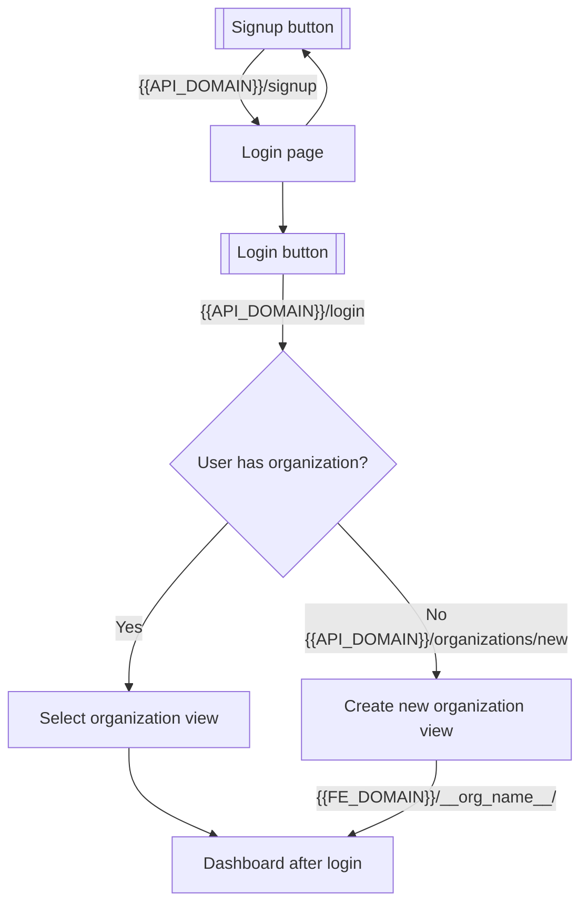

## Login/Signup flow

```mermaid
graph TD
    login_button[[Login button]]
    signup_button[[Signup button]]
    login_page[Login page]
    create_org_page[Create new organization view]
    select_org_page[Select organization view]
    dashboard[Dashboard after login]

    has_org_confirmation{User has organization?}

    login_page --> login_button
    login_page --> signup_button

    signup_button -- {{API_DOMAIN}}/signup --> login_page
    login_button -- {{API_DOMAIN}}/login --> has_org_confirmation
    has_org_confirmation -- Yes --> select_org_page
    has_org_confirmation -- No\n{{API_DOMAIN}}/organizations/new --> create_org_page
    select_org_page --> dashboard
    create_org_page -- {{FE_DOMAIN}}/__org_name__/ --> dashboard
```
