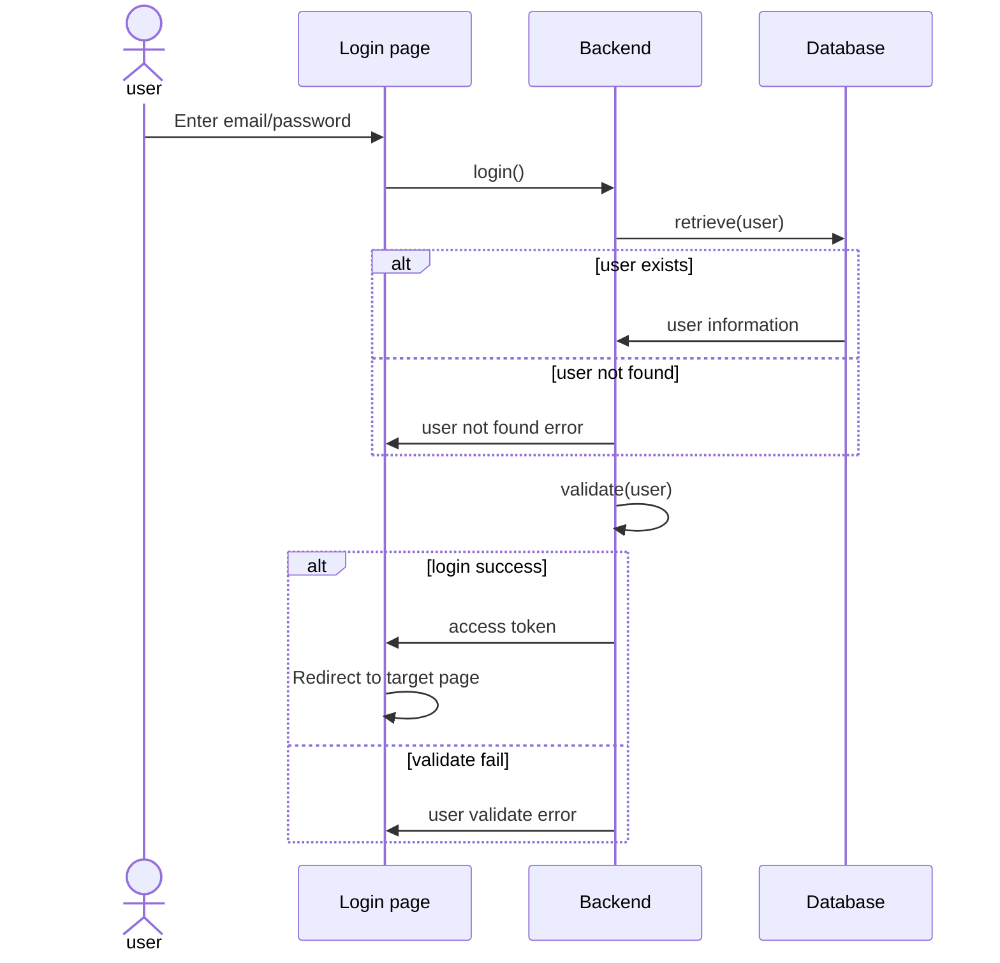

# Login sequence

```mermaid
sequenceDiagram
    actor user
    participant Login page
    participant Backend
    participant Database
    user->>Login page: Enter email/password
    Login page->>Backend: login()
    Backend->>Database: retrieve(user)

    alt user exists
        Database->>Backend: user information
    else user not found
        Backend->>Login page: user not found error
    end

    Backend->>Backend: validate(user)
    alt login success
        Backend->>Login page: access token
        Login page ->> Login page: Redirect to target page
    else validate fail
        Backend->>Login page: user validate error
    end
```